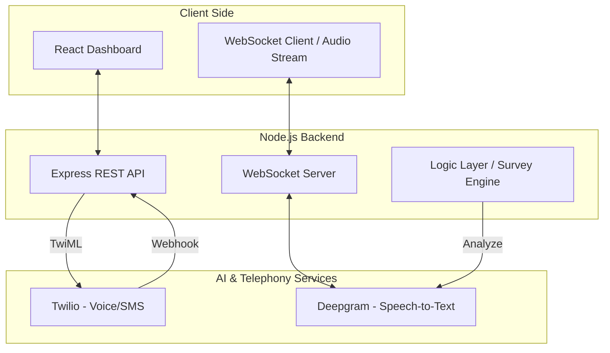

# 🎙️ Voice Survey AI

Voice Survey AI is a cutting-edge, voice-first platform designed to transform traditional surveys into interactive, engaging conversations. By leveraging real-time speech transcription (Deepgram) and telephony integrations (Twilio), it provides a seamless experience for both responders and administrators.

---

## 🏗️ System Architecture



---

## 🌟 Key Features

- **Real-time Transcription**: Powered by Deepgram's Nova-2 model.
- **Interactive Telephony**: Full integration with Twilio Voice.
- **Modern Dashboard**: React 18 + Vite + Glassmorphism UI.
- **Hybrid Interaction**: Browser-based voice and traditional phone calls.

---

## 🚀 Getting Started

### 1. Configuration (`server/.env`)
```env
PORT=3001
DEEPGRAM_API_KEY=your_key_here
TWILIO_ACCOUNT_SID=your_sid_here
TWILIO_AUTH_TOKEN=your_token_here
TWILIO_PHONE_NUMBER=your_number_here
```

### 2. Installation & Run
```bash
# Backend
cd server && npm install && npm start

# Frontend
npm install && npm run dev
```

---

## 💻 Tech Stack
- **Frontend**: React, Vite, Framer Motion.
- **Backend**: Node.js, Express, WebSockets.
- **Services**: Twilio, Deepgram.
